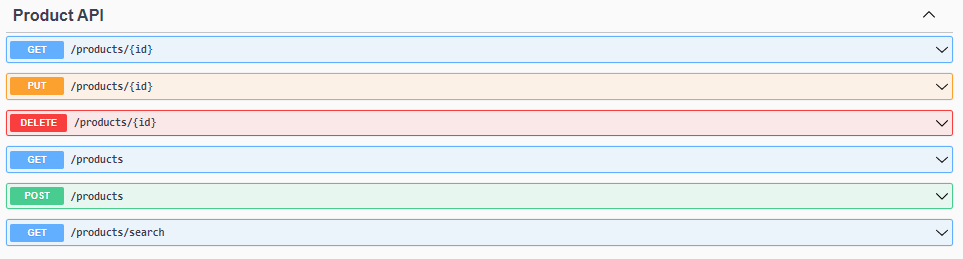

# Product Catalog
> A simple product catalog. This version does not require authentication.

In this microservice it is possible to create, change, view and delete a specific product, in addition to viewing the list of current available products. It is also possible to search for products by filtering by * name, description and price *.

The format of a product is as follows:

``` javascript
   {
     "id": "string",
     "name": "string",
     "description": "string",
     "price": 1.00
   } 
```



## Running

Windows, OS X & Linux:

```sh
cd ./back-java-version/productCatalog
mvn spring-boot:run
```

After try open http://localhost:9999/swagger-ui/index.html

## Usage example

The following endpoints are available for product catalog operation:

| HTTP verb   |  Resource path    |         Description             |
|-------------|-------------------|---------------------------------|
| POST        |  /products        |   Creating a product            |
| PUT         |  /products/{id}   |   Updating a product            |
| GET         |  /products/{id}   |   Searching for a product by ID |
| GET         |  /products        |   List of products              |
| GET         |  /products/search |   List of filtered products     |
| DELETE      |  /products/{id}   |   Deletion of a product         |


## Release History

* 0.0.2
    * change product id to String (UUID) and add a basic angular frontend
* 0.0.1
    * Simple product catalog. This version does not require authentication.

## Meta

Thiago Carvalho – thiago.cmv@gmail.com - [https://onovoprogramador.blogspot.com](https://onovoprogramador.blogspot.com)

Distributed under the GNU GENERAL PUBLIC LICENSE license. See ``LICENSE`` for more information.

[https://github.com/tgcmv/productCatalog](https://github.com/tgcmv/productCatalog/)

## Contributing

1. Fork it (<https://github.com/tgcmv/productCatalog/fork>)
2. Create your feature branch (`git checkout -b feature/fooBar`)
3. Commit your changes (`git commit -am 'Add some fooBar'`)
4. Push to the branch (`git push origin feature/fooBar`)
5. Create a new Pull Request
